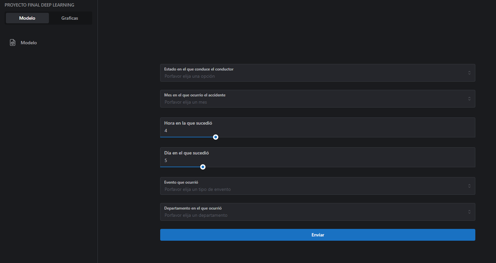
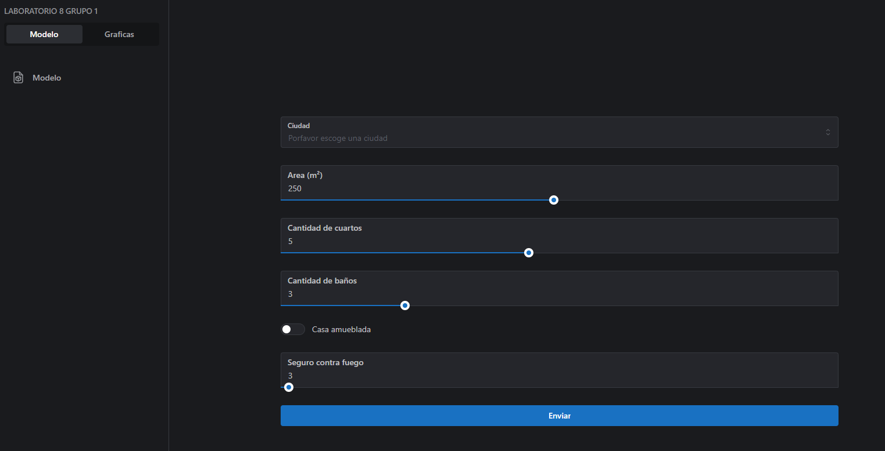
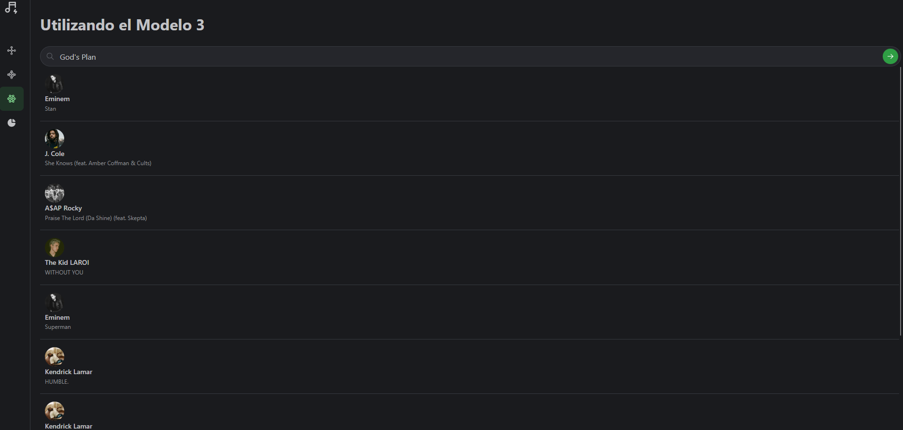

## Hey 👋, I'm Pablo Gonzalez!  
  

  
  

### Glad to see you here!  
I'm Pablo Gonzalez, a Computer Science student at the University of Valle residing in Guatemala City. My passion lies in the field of Artificial Intelligence and Deep Learning. I've undertaken projects in various programming languages such as Java, Python, and JavaScript. This repository serves as a portfolio of my work, reflecting my dedication to technological innovation and problem-solving. I'm eager to collaborate and engage with fellow enthusiasts in the ever-evolving world of AI and Deep Learning. Thank you for visiting, and let's explore the exciting possibilities together.  
  

   

## Rapidfire  

- 🔭 I’m currently working on [Data Science](https://github.com/IPablo271/Data-science)  
  

- 🌱 I’m currently learning Data Science   

</td><td valign="top" width="50%">

   

## Languages and Tools  

  
  
  
  
  
  
  
  
  
  
  
  
  
  
  
  
  
  
  
  
  
  
  
  
  
  
  
  
  
  
  

  

   

## Github Stats  
<table><tr><td valign="top" width="50%">

</td><td valign="top" width="50%">

</td></tr></table>  

   

  

   

## Proyectos Realizados

| Predicción de tipo de vehiculo involucrado en accidentes  | Predicción del precio de rentas para casas en brasil| Sistema de recomendación de música |
| --- | --- | --- |
|  |  |  |
| Este proyecto se enfoca en el desarrollo e implementación de modelos de inteligencia artificial para predecir el tipo de vehículo involucrado en accidentes de tráfico en la República de Guatemala. Utilizando un conjunto de datos que abarca desde 2017 hasta 2020, se han aplicado técnicas de análisis exploratorio y preprocesamiento para comprender las complejidades de los accidentes de tráfico. La metodología se basa en la implementación de redes neuronales con la biblioteca TensorFlow, con la progresión hacia modelos más complejos para mejorar la capacidad predictiva. Los resultados revelan una mejora significativa en la precisión, destacando un modelo con una tasa del 76.44%. Este proyecto busca contribuir a la seguridad vial al identificar patrones y factores de riesgo, permitiendo medidas preventivas y mejoras en la gestión del tráfico en Guatemala. | Este proyecto aborda el análisis y predicción de los precios de alquiler de viviendas en Brasil mediante técnicas avanzadas de inteligencia artificial. Después de explorar y preprocesar un extenso conjunto de datos, se utiliza un modelo de regresión de bosques aleatorios, optimizado mediante búsqueda de hiperparámetros, para prever los costos de alquiler. La evaluación del modelo revela su capacidad predictiva, medida por el Error Absoluto Medio (MAE) y el Error Cuadrático Medio (MSE). Se incluye una interfaz para realizar predicciones personalizadas, exemplificada con datos de entrada específicos. Este proyecto ofrece insights sobre los factores que influyen en los precios de alquiler en el mercado inmobiliario brasileño y proporciona una herramienta práctica para estimaciones personalizadas basadas en las preferencias del usuario.| Este proyecto se centra en la construcción de un sistema de recomendación de canciones utilizando técnicas de filtrado colaborativo y similitud coseno. La implementación se basa en el análisis de un extenso conjunto de datos de música, abarcando información sobre géneros, características acústicas y años de lanzamiento. A través de la normalización de características y el cálculo de similitudes, el modelo puede sugerir hasta 10 canciones similares a una dada. La escalabilidad y eficacia del sistema se logran mediante el uso de la biblioteca scikit-learn para el preprocesamiento y la comparación de similitudes. Este proyecto proporciona una experiencia de usuario mejorada al descubrir nuevas canciones afines a las preferencias del usuario, contribuyendo así a la exploración musical y recomendación personalizada. |

  
  

   

 

----

